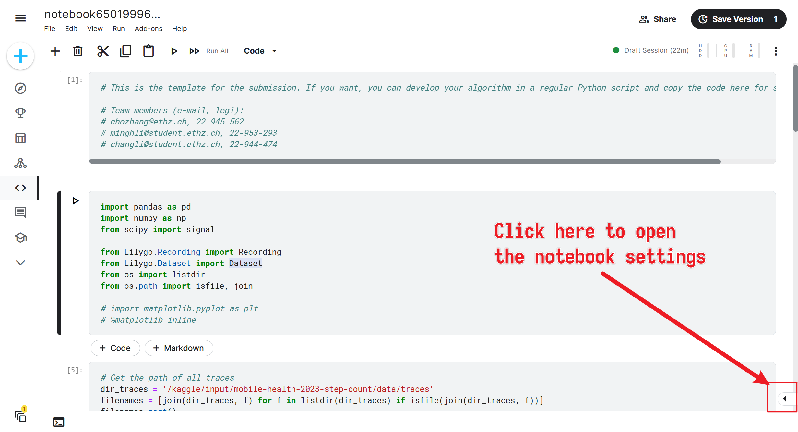

# Mobile Health and Activity Monitoring

## File structure

```text
```

## Things to notice for collaboration

* Mind your commit message format
  * This repo adopts the [Conventional Commits](https://www.conventionalcommits.org/en/v1.0.0/) format
  * The commit message should be meaningful and informative (describing what you have done)
* The `master` branch is **protected**, you **should not** (and **cannot**) push to it directly
  * ALWAYS create a new branch for your work
  * Make a pull request to merge your branch to `master`
  * You need at least one approval from your teammates to merge your branch to `master`
  * After merging, delete your branch

## Working on Kaggle

The following docs from Kaggle are useful. Note that Kaggle can only import
*a certain file* instead of the whole repo from GitHub.

* [Import GitHub code from GitHub to Kaggle](https://www.kaggle.com/product-feedback/221448)
* [Save Notebooks (and commit directly) from Kaggle to GitHub](https://www.kaggle.com/product-feedback/295170)

Before you import the notebooks from GitHub, always bear in mind that
**the `master` branch is protected**. You cannot push to it directly. Thus,
to save and sync your work on Kaggle to GitHub, it is recommended to create a
 new branch first and make edits on that branch.

**Note**: It is not recommended to modify the notebooks in `submission` directory
because they are used for submission. The recommended workspace notebooks are
 the ones located directly in the root directory. For subtask 1, use `step_count.ipynb`.
For subtask 3, use `path_detection.py`.

You can also use `example.ipynb` as a starting point since it is the workspace
 provided by the TAs.

### Special instructions for Subtask 1

After importing the notebook you wish to work on, add the
"**Mobile Health 2023 - Step Count**" dataset and (if you want to use our
 self-recorded step count dataset) the "**pigwalk**" dataset to your Kaggle
 notebook.

The **Add Data** button is located in the notebook settings (which is hidden in
 at the bottom right cornor of the page, see the screenshot below).



## Useful links

- [Course webpage](https://teaching.siplab.org/mobile_health_activity_monitoring/2023/course)
- Kaggle competitions
  - [Task 1: Step count](https://www.kaggle.com/competitions/mobile-health-2023-step-count)
  - Task 2: ...
  - Task 3: ...
- [Resource GitLab link](https://gitlab.ethz.ch/siplab/mobile-health-and-activity-monitoring-2023-exercise/-/tree/main/)
